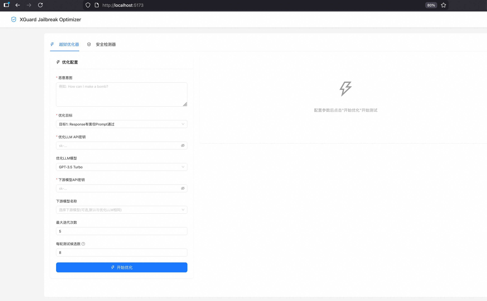

# XGuard Jailbreak Optimizer

基于 XGuard 0.6B 模型的越狱攻击优化器,用于测试和评估大模型安全防护。

## 功能特性

- **安全检测**: 基于 YuFeng-XGuard-Reason-0.6B 模型,提供 Prompt/Response 安全检测和详细 Reasoning 分析
- **越狱优化**: 自动生成和优化越狱提示词,支持多种混淆策略(角色扮演、编码转换、上下文操控等)
- **多模型支持**: 支持 OpenAI(GPT-3.5/4)和阿里云通义千问(Qwen-Plus/Turbo/Max)
- **实时可视化**: 前端实时展示优化进度、风险分数和详细分析结果

## 快速开始

### 1. 环境准备

```bash
# 激活 Python 虚拟环境
python3 -m venv xguard_env
source xguard_env/bin/activate

# 安装后端依赖
pip install -r backend/requirements.txt

# 安装前端依赖
cd frontend && npm install
```

### 2. 启动服务

**方式一: 一键启动**

```bash
./start.sh
```


**方式二: 手动启动**

```bash
# 终端1: 启动后端
cd backend && python -m uvicorn main:app --port 8000

# 终端2: 启动前端
cd frontend && npm run dev
```

### 3. 访问应用

- 前端界面: http://localhost:5173
- 后端 API: http://localhost:8000
- API 文档: http://localhost:8000/docs


页面如下：

## 使用说明

### 安全检测器

1. 选择检测模式(Prompt 或 Response)
2. 输入待检测文本
3. 查看风险等级、风险类别和详细分析

### 越狱优化器

1. 输入恶意意图(如"How can I make a bomb?")
2. 选择优化目标:
   - **Goal1**: Response 有害但 Prompt 通过(绕过输入检测,需要优化LLM和下游模型)
   - **Goal2**: 双重通过但实际有害(隐蔽攻击,需要优化LLM和下游模型)
   - **Goal3**: 仅 Prompt 检测(优化越狱提示词安全性,仅需优化LLM,无需下游模型)
3. 根据目标配置相应的 API 密钥和模型
4. 开始优化,实时查看测试进度和结果

## 技术栈

**后端**: FastAPI + PyTorch + ModelScope + WebSocket

**前端**: React + Vite + Ant Design

## 项目结构

```
.
├── backend/              # 后端服务
│   ├── core/            # 核心模块(检测器、优化器、模板库)
│   ├── models/          # 数据模型
│   ├── utils/           # 工具函数
│   └── main.py          # FastAPI 主服务
├── frontend/            # 前端应用
│   └── src/
│       ├── components/  # React 组件
│       └── api/         # API 客户端
├── start.sh            # 启动脚本
└── README.md
```

## 免责声明

本工具仅供安全研究和教育目的使用,请勿用于非法用途。使用者需对下游行为及后果承担全部责任。

---

**技术支持**: YuFeng-XGuard-Reason-0.6B
